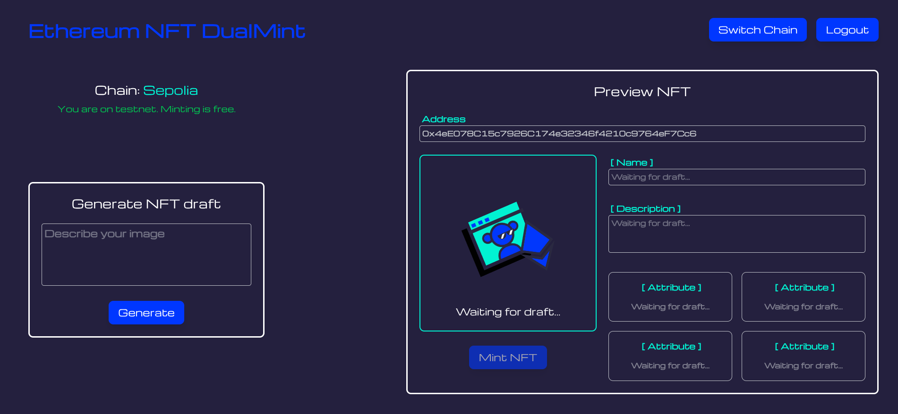

# Ethereum-NFT-DualMint

Mint image-based NFTs from a prompt using AI. Available on **Ethereum Mainnet** and **Sepolia Testnet**. Ready for **OpenSea** and other NFT marketplaces.

---

## Live Preview

  <strong>**_Mint NFT_**</strong>  
   
  <a href="https://ethereum-nft-mint.com">ethereum-nft-mint.com</a>

---

## Prerequisites

- MetaMask wallet
- MetaMask extension

---

## How it works?

1. Connect MetaMask wallet
2. Choose between **Ethereum Mainnet** and **Sepolia Testnet**
3. Enter a prompt describing your image
4. Wait for the AI to generate the NFT data
5. Preview and mint NFT
